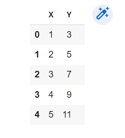
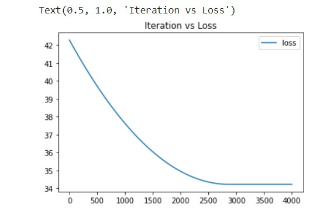
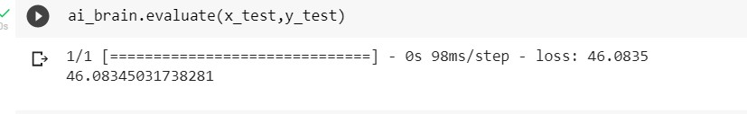
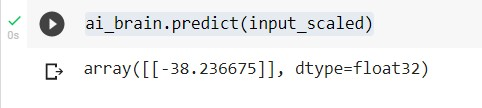

# Developing a Neural Network Regression Model

## AIM

To develop a neural network regression model for the given dataset.

## THEORY

Taining the algorithm to predict the regression model for X and Y which are logically related

## Neural Network Model

Include the neural network model diagram.

## DESIGN STEPS

### STEP 1:

Loading the dataset 

### STEP 2:

Split the dataset into training and testing

### STEP 3:

Create MinMaxScalar objects ,fit the model and transform the data.

### STEP 4:

Build the Neural Network Model and compile the model.

### STEP 5:

Train the model with the training data.

### STEP 6:

Plot the performance plot

### STEP 7:

Evaluate the model with the testing data.

## PROGRAM

```
import pandas as pd
from google.colab import auth
import gspread
from google.auth import default

auth.authenticate_user()
creds, _ = default()
gc = gspread.authorize(creds)

from sklearn.model_selection import train_test_split
from sklearn.preprocessing import MinMaxScaler
from tensorflow.keras.models import Sequential
from tensorflow.keras.layers import Dense
import tensorflow as tf
tf.__version__

worksheet = gc.open('Newdataset').sheet1
rows = worksheet.get_all_values()
df = pd.DataFrame(rows[1:], columns=rows[0])

df.head()

df=df.astype({'X':'float'})
df=df.astype({'Y':'float'})

x=df[['X']].values
y=df[['Y']].values
x

y

from sklearn.model_selection import train_test_split
from sklearn.preprocessing import MinMaxScaler
from tensorflow.keras.models import Sequential
from tensorflow.keras.layers import Dense

x_train,x_test,y_train,y_test=train_test_split(x,y,test_size=0.33,random_state=50)

scaler=MinMaxScaler()
scaler.fit(x_train)
x_train_scaled = scaler.transform(x_train)
x_train_scaled

ai_brain = Sequential([
    Dense(2,activation='relu'),
    Dense(1)
])

ai_brain.compile(optimizer='rmsprop',loss='mse')

ai_brain.fit(x=x_train_scaled,y=y_train,epochs=4000) 

loss_df=pd.DataFrame(ai_brain.history.history)
loss_df.plot()
import matplotlib.pyplot as plt
plt.title("Iteration vs Loss")

x_test

x_test_scaled=scaler.transform(x_test)
x_test_scaled

ai_brain.evaluate(x_test,y_test)

input=[[4000]]
input_scaled=scaler.transform(input)
input_scaled.shape

input_scaled

ai_brain.predict(input_scaled)
```

## Dataset Information

 

## OUTPUT

### Training Loss Vs Iteration Plot



### Test Data Root Mean Squared Error



### New Sample Data Prediction


 

## RESULT
Thus the value of Y is predicted.

